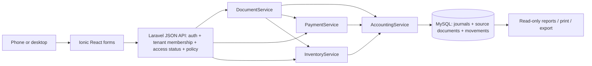
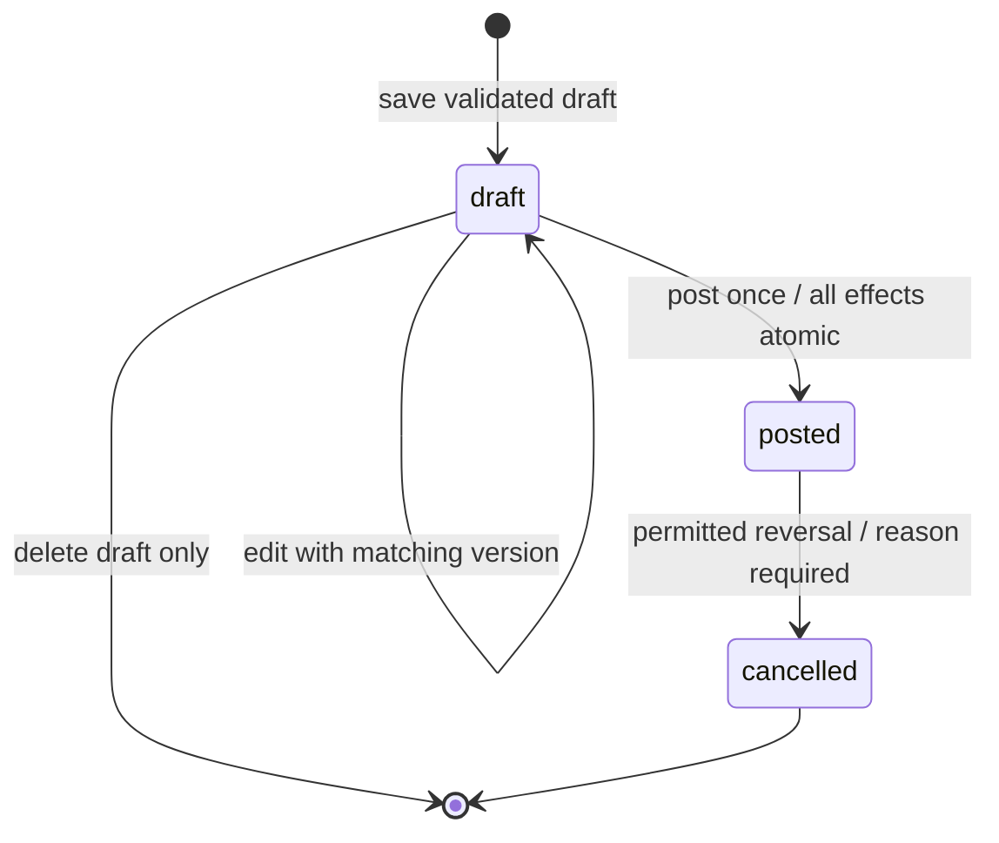

# Simple mobile accounting — complete application specification

Version 1.2 · 2026-10-02 · Laravel 13 backend + Ionic React frontend · daily-action forms · Nepal small businesses.

Read [MONOREPO-CONTRACT.md](MONOREPO-CONTRACT.md) for authoritative workspace, API, authentication and UI path translation. Owner-selected Ionic supersedes earlier Blade UI instructions.

Owner's subsequent scope extension authorises eight industry POS profiles,
multi-branch grouping, configurable units, restaurant waiter/kitchen ordering and
barber/salon scheduling. [INDUSTRY-POS.md](INDUSTRY-POS.md) and the industry
extension in MONOREPO-CONTRACT.md supersede the earlier exclusions for those
features. One location remains one isolated branch ledger/stock pool. Android/iOS
remain required after web-first delivery; native builds have not been verified.

## 1. Product contract

Build a separate, mobile-friendly, multi-tenant accounting application inspired by the daily business jobs described by Karobar and Dhadda. A shop owner must record purchases, sales, money received/paid and expenses without understanding debit/credit. The application maintains trustworthy contacts, inventory, dues and accounting behind those forms.

Owner clarification: every operation uses a day-to-day business form. No user enters DR/CR, selects debit/credit sides, balances a journal, or chooses accounting control accounts. This applies to every role, including accountant. Automatic double-entry remains an internal correctness mechanism. Generic manual-journal entry is excluded; purpose-specific forms are the only financial write paths.

User requirements: Laravel 13, PHP 8.4 using `php84` and `composer84`, another application, simple/easy, mobile friendly, small-business accounting, sales/purchases, multi-tenancy, and enough detail for a less capable coding agent to implement. Everything marked as a default below is a proposed product decision, not a requirement attributed to the owner.

Default audience: Nepal retailers, small wholesalers and service businesses, typically one shop, one owner and a few staff. NPR only. One location per tenant. Online browser access. Product name is configurable `APP_NAME`; use “Business Book” as development copy only. Competitor names, branding and artwork must not be reused.

Success measures:

- Owner can create business and first item in under five minutes without opening accounting settings.
- Returning operator can enter a three-line cash sale in under 45 seconds on a 390px-wide phone.
- Sale/purchase automatically updates journal, stock, party balance and payment status exactly once.
- Tenant A cannot read or mutate Tenant B's rows, lookup results, printouts, attachments or exports.
- Journal balances to the paisa; stock never goes negative; trial balance and balance sheet reconcile.
- Failed writes leave no partial document, journal, payment, allocation, stock or audit records.

## 2. Scope and explicit exclusions

### 2.1 First release, all required

1. Registration, email verification, login/logout and password reset.
2. Business onboarding, business switcher, English/Nepali preferences, profile/logo/PAN fields.
3. Fixed-role staff invitations, revocation and last-owner protection.
4. Customer/supplier contacts, search, archive, opening balances and statements.
5. Items/services, base unit, SKU, prices, tax category, low-stock threshold and opening stock.
6. Sales and purchases, drafts, posting, partial payment and source-linked returns.
7. Customer receipts, supplier payments, customer refunds and supplier refunds; allocation to documents.
8. Simple expense documents, optional supplier and category; paid or outstanding.
9. Cash/bank account balances, transfers, owner contributions and withdrawals.
10. Stock adjustment with reason, movement history, moving-average costing and low stock.
11. Dashboard, transaction/party reports, cashbook, stock, P&L, trial balance and balance sheet.
12. Bookkeeping invoice/receipt printouts, CSV exports, private receipt attachments.
13. Immutable posted journals, linked reversals, audit trail and financial date lock.
14. Basic platform administration: tenants, access dates/status, staff/owner contact and aggregate usage.
15. Backups, restore drill, scheduler/worker health and installable web manifest.

### 2.2 Later only when explicitly requested

Offline posting/sync; Android/iOS apps; public API; subdomains/custom domains; database per tenant; branches/warehouses; multiple currencies; batch/expiry/serial tracking; unit conversions; barcode camera scanning; GST/excise/TDS rules; payroll; manufacturing; cooperative banking; restaurant workflows; AI/OCR; marketing site/blog; automatic SMS/email/WhatsApp reminders; public invoice links; bank feeds; payment gateways; custom role builder; subscription payment collection; formal year-end closing/retained-profit distribution; data migration from dairy; CSV bulk imports.

Keyboard barcode readers may populate existing SKU search as ordinary text; no scanner module is required. Native browser print/save-as-PDF handles initial document download. No server PDF library unless actual print limitations justify it.

### 2.3 Regulatory release boundary

First release is internal bookkeeping. Print heading: “BOOKKEEPING INVOICE”; include “Business record — statutory tax invoice mode not enabled.” Do not advertise IRD verification, claim tax compliance, or issue purported statutory invoices merely because tax columns exist.

Before offering regulated invoicing: owner confirms target taxpayer types; current IRD rules/annexes/amendments and software-registration process reviewed; applicable tax categories/recoverability verified; statutory print/numbering/cancellation rules specified; required CBMS integration and retries implemented and tested. Until then tax amounts are configurable bookkeeping calculations with no compliance claim. This is a functional release boundary, not permission to weaken accounting correctness.

## 3. Architecture and stack decisions

| Decision | Selected baseline | Why |
|---|---|---|
| Application | Laravel 13 backend + Ionic React frontend monorepo | Explicit owner requirement; one business backend |
| PHP | PHP 8.4 via `php84`; Composer via `composer84` | Explicit owner requirement |
| Exact arithmetic | PHP BCMath extension for intermediate products/division; stored results remain int paisa | Avoid overflow while retaining exact rounding |
| Database | MySQL 8.4 LTS, InnoDB, utf8mb4, strict mode | Transactions, locks and composite FKs |
| Views | Ionic React pages | Mobile daily-action forms |
| CSS/build | Ionic CSS + local CSS via Vite | Mobile components and local asset build |
| JavaScript | TypeScript, native fetch, BigInt previews | Exact previews; backend authoritative |
| Authentication | Headless Fortify + Sanctum session cookies | First-party browser login/reset/verification |
| Authorization | Laravel policies + fixed role map | Explicit server enforcement |
| Tenant storage | Shared DB/table `tenant_id` | Lowest small-app operations burden |
| Queue/session/cache | Laravel database drivers initially | No Redis dependency for low volume |
| Files | Private local disk; tenant prefix | Authorization on every download |
| Tests | Scaffold's PHPUnit setup | Exact financial/security regressions |
| Printing/export | Print CSS + streamed CSV | Native tools first |

Do not reuse dairy vendor directory, composer lock, framework bootstrap, table constants, helpers autoload, Passport, menu engine, global env flags, or entire NepaliDate class. Port only isolated calendar data/conversion code after inspecting dependencies. New app follows Laravel 13 middleware registration in `bootstrap/app.php`, not Laravel 8 Kernel instructions.

No repositories/interfaces/factories around each model. Use Eloquent relationships, Form Requests, policies and five concrete feature services:

- `app/Service/TenantService.php`: business creation, membership/invitations, access transitions.
- `app/Service/DocumentService.php`: sale/purchase/expense/return drafts, totals, posting and cancellation.
- `app/Service/PaymentService.php`: money received/paid/refunded, allocations, transfers and payment cancellation.
- `app/Service/AccountingService.php`: seeded chart, balanced journal posting/reversal, openings, owner entries and close-through.
- `app/Service/InventoryService.php`: stock pool/movements/costing, opening stock and adjustments.

One service per feature; do not split a feature into bootstrap/permission/token/sync services. Helpers `Money`, `NepaliDate` and `NepaliDateHelper` provide value/date operations, not alternate financial write paths. Reports can use explicit queries in `ReportController`; extract repeated small query methods there before proposing another service.



## 4. Tenant, authentication and role contract

### 4.1 Shared identity, separate businesses

`users` are global login identities. `tenants` are businesses. `tenant_user` provides active memberships and role. One user can belong to several businesses; selected business lives in session as `active_tenant_id`.

Tenant URLs use `/app/{tenant:slug}/...`. The URL identifies requested context; middleware resolves tenant and rechecks authenticated active membership on every request. The session stores preference only and never grants authorization. A form generated in Tenant A must submit to Tenant A's URL even after a second tab switches to Tenant B. Never derive write tenant from mutable session alone.

Tenancy layers, all mandatory:

1. `ResolveTenant` middleware resolves slug, active membership and tenant status, then binds a request-scoped `CurrentTenant` object. Unauthenticated -> login; non-member/foreign record -> 404.
2. `BelongsToTenant` model trait adds tenant scope and stamps `tenant_id` on create. Missing context must fail closed, including CLI/job calls; do not return all rows when no tenant is selected.
3. Route binding resolves child rows inside current tenant. Authorization policy checks membership role and action. A matching ID alone is insufficient.
4. Request validation scopes every `exists`/`unique` to current tenant. Never accept posted `tenant_id`, actor, role or total fields as authoritative.
5. Composite foreign keys prevent a Tenant A document from referencing Tenant B's contact/item/account even if application validation fails.
6. Raw queries always include tenant predicates on all tenant roots/joins. Trait scopes do not apply to `DB::table()`. Tests cover raw-query/report/export paths.

`CurrentTenant::id(): int` throws if unset; `set(Tenant $tenant): void` and `clear(): void` are used by explicit job/console contexts. Container binding is scoped, not static global state. Clear in `finally` for queued jobs and long-lived processes. No blanket `withoutGlobalScopes()` controller calls. Platform queries may list tenants/memberships only; financial access requires explicit membership as with any user.

### 4.2 Roles

| Action | Owner | Manager | Cashier | Accountant |
|---|---|---|---|---|
| Dashboard business totals, financial reports | Yes | Yes | Own-sales summary only | Yes |
| Create/edit contact basics | Yes | Yes | Yes | Yes |
| Contact full statement/export | Yes | Yes | No | Yes |
| View item selling price, available quantity | Yes | Yes | Yes | Yes |
| View item costs, profit, bank balances | Yes | Yes | No | Yes |
| Sales drafts/post, receipt against sale | Yes | Yes | Yes | Yes |
| View sales | All | All | Own documents | All |
| Purchase/expense entry and supplier payment | Yes | Yes | No | Yes |
| Returns/refunds/cancel posted records | Yes | Yes | No | Yes |
| Stock adjustment | Yes | Yes | No | No |
| Guided starting balances/close-through | Yes | No | No | Yes |
| Business settings/cash-bank accounts/staff | Yes | No | No | No |
| Owner contribution/withdrawal/transfer | Yes | Yes | No | Yes |
| Business export and operational audit | Yes | No | No | Yes |

Cashier's hidden fields must also be absent from HTML, JSON lookups and CSV endpoints; hiding UI buttons is not authorization. Contact quick-add never returns old outstanding balances to cashiers. Cashier cannot issue unallocated receipt, refund or overpayment; can receive against own open sales only.

Preserve at least one active owner. Lock tenant while changing membership/ownership to prevent two concurrent demotions removing all owners. An owner can transfer ownership by adding another owner first. Do not permit registration request to set `is_platform_admin`.

### 4.3 Account access and platform administration

Use verified email/password sign-in. Phone is optional business/contact information; no OTP/SMS provider required initially. Fortify handles throttling, hashing, session regeneration, verification and password broker. Log out invalidates session and regenerates CSRF token. Tenant switching validates membership, clears local unsaved form state after confirmation and redirects to that tenant's home.

Invitation: owner enters email/role; save a hashed random token with seven-day UTC expiry; email a link. Invited user logs in/registers with exactly the invited verified email; acceptance validates hash, tenant access and expiry, creates unique membership atomically and invalidates token. Owner cannot invite platform administrators. Revoked staff lose access immediately, even with existing sessions.

Platform administrator is a global `is_platform_admin` flag checked only on `/platform` routes. It allows business/access administration, never automatic business financial access, data impersonation or global policy bypass. Provision first administrator through an audited console command; no default password or hardcoded phone.

Default trial: 14 days. `trial`/`active` with unexpired access -> normal use. `expired` -> read/print/export available to owners/accountants, all business mutations disabled. `suspended` -> only safe account/help screen; business data inaccessible. Renewal is a manual platform update of access dates with reason/audit; billing gateways, plan price and fees deferred. Logout, password reset and profile security remain available in all access states. Date-based entitlement uses UTC timestamps, not BS dates.

## 5. Mobile information architecture and screens

### 5.1 Common layout

Design mobile first at 360–430px, desktop after. Five bottom items: Home, Sales, Parties, Items, More. More contains Purchases, Expenses, Money, Reports, Settings; permission-filtered. Home presents large New Sale, New Purchase, Receive Money, Pay Money actions as allowed. Desktop uses same navigation in a left sidebar, not separate product.

Top bar shows business name/switcher, current BS date and profile. Primary form action stays in a bottom sticky bar above safe area; content has enough bottom padding. Touch targets >=44px; text inputs >=16px; visible labels, inline errors and keyboard focus. Avoid horizontal scrolling on primary screens, nested table scroll, hover-only actions, tiny icon-only controls and destructive swipe gestures.

Use `inputmode="decimal"` for money/quantity; actual business validation is server-side. Native select for few options; searchable contact/item picker for larger data, accessible combobox with keyboard and screen-reader state. No select plugin required. All copy translated through `__('...')`; `en` and `ne` language files. Nepali text input accepted; numeric parser normalizes Nepali digits. Legacy `np` folder and `class="ms"` requirements belong to dairy views and are not copied.

Colors: calm neutral background, one primary blue/green, red for irreversible financial confirmation. Color never sole status cue; badges include text. Empty state includes one relevant action. Network error preserves form state, says “Could not confirm save. Retry safely.” and retries same mutation UUID.

### 5.2 Screens and workflows

Section 5.3 defines required form fields and plain-language flows. Technical debit/credit notation elsewhere in this document is for implementing the internal engine, never UI form copy.

| Screen | Main information | Primary action / constraints |
|---|---|---|
| Sign in/register/reset/verify | Email, password, recovery | Fortify routes; accessible form |
| Business list | Membership businesses, role, status | Choose business; create new business |
| Onboarding | Name, address, phone, PAN, bookkeeping/tax settings, language | Create; seed chart/default cash/walk-in party atomically |
| Home | Today net sales, receipts, customer dues, supplier dues, cash/bank, low stock, recent activity | Four daily actions; no advanced chart initially |
| Contacts | Name, phone, customer/supplier flags, balances for allowed roles | Search/create; separate receivable/payable chips |
| Contact details | Profile, separate sales/purchases balances, statement, documents/payments | Receive/pay; archive; historical data retained |
| Items | Name, SKU, selling price, qty, low-stock badge | Search/create; cost hidden from cashier |
| Item details | Item/service fields, available quantity, valuation and movements where allowed | Edit master; stock adjustment via separate document |
| New sale | Customer, BS date, items, discount, tax, total, paid now, method, due | Save Draft or Post Sale; totals server-calculated |
| New purchase | Supplier, source bill number/date, items/cost, tax eligibility, paid now | Draft/Post; supplier required |
| New expense | Category, amount, optional supplier, tax, date, payment | Draft/Post; credit expense requires supplier |
| Document list | Type, number, date, party, total, status, due/credit | Search/filter; cursor/page pagination |
| Document detail | Snapshots, lines, totals, payment/return history, creator | Print, receive/pay, return, cancel as permitted; no editable journal link |
| Return form | Original invoice, remaining returnable qty per line, reason, refund toggle | Return only source lines/prices; refund explicit |
| Money form | Kind, contact, cash/bank, amount, BS date, allocation rows, reference | Post payment; no silent netting |
| Transfer | Source and destination cash/bank, amount, BS date, note | Post balanced transfer; distinct accounts |
| Stock adjustment | Item, counted qty or signed adjustment, reason | Preview before/after; never edit stock field |
| Reports | BS range presets, search, total, detail, print/CSV | Read-only; bounded filters |
| Settings | Business, staff, money accounts, defaults, openings, close-through | Owner role or accounting policy |
| Audit | Date, actor, action, source, reason, safe details | Read-only and paginated |
| Platform | Businesses, owner email, access dates/status, usage count | Manual access update with reason |

Sale flow: pick customer (Walk-in default) -> add items -> quantities/rates -> optional invoice discount -> inspect total -> choose Paid now (default total for Walk-in, user chooses for named customer) -> Post. Only one primary save button. Cash received greater than total is tender/change UI; payment recorded is total, change is difference. Named-customer overpayment is a separate owner/accountant money transaction, not change on sale.

Line editor: item search returns maximum 20 hits; initial load never sends whole inventory. Add selected item, display unit/price/availability, edit quantity/rate, remove line. Repeated stock item must merge into one line when same price/tax; otherwise reject duplicate item rows in MVP to simplify stock and return identity. Service rows may be separate. Collapse advanced tax/discount/notes under a readable disclosure. Dynamic rows carry accessible labels; focus moves predictably after add/remove.

Draft and posted are visually distinct. Draft has no official number, stock reservation, ledger or money effect. After posting, detail page with number and success message. Print is secondary. Posted “Edit” is absent; Clone creates fresh draft; Cancel/Return has its own explained confirmation.

### 5.3 Day-to-day forms — mandatory product contract

Home action sheet groups **Sell**, **Buy**, **Money**, **Stock**. Show permitted actions with familiar verbs. Each action opens a dedicated task form; never one generic transaction grid asking users to choose account/DR/CR. Cash/bank selection is labelled “Received into”, “Paid from”, “From” or “To”; expense category is a business label, not a chart-code selector.

| User action / form | User supplies | App handles automatically | Visible result |
|---|---|---|---|
| **Make a sale** | Customer or Walk-in, items/services, quantity, price, optional discount, date; Paid / Part paid / Pay later; received amount and method when needed | Totals, tax, stock cost/outflow, party dues, journal, optional receipt | Sale saved; bill total, received, customer still owes |
| **Record a purchase** | Supplier, supplier bill reference, items, quantities, cost, date; Paid / Part paid / Pay later | Inventory value, tax handling, supplier dues, journal, optional payment | Stock added; paid and still to pay |
| **Receive customer money** | Customer, amount, received into Cash/Bank, date, optional reference | Suggest eligible unpaid bills oldest-first; validate allocations and payment posting | Money received; customer remaining due/advance shown separately |
| **Pay supplier** | Supplier, amount, paid from Cash/Bank, date, optional reference | Suggest unpaid purchases/expenses; validate funds and posting | Money paid; supplier remaining due or advance |
| **Record an expense** | Category such as Rent, amount, date, note; Paid now or Pay later; supplier required for Pay later | Expense/category accounting and optional money payment | Expense saved; paid or outstanding |
| **Return sold goods** | Original sale, returned quantities, reason, date; optional Refund now and payment method | Original price/discount/tax/cost, remaining return allowance, stock restoration, dues/refund calculation | Goods returned; remaining due or refund available |
| **Return purchased goods** | Original purchase, quantities, reason, date; supplier refunded now or refund pending | Supplier bill reduction, stock out, tax/cost difference and refund record | Stock reduced; supplier bill reduced/refund pending |
| **Move money** | From Cash/Bank, To different Cash/Bank, amount, date, note | Paired transfer posting and funds check | Source/destination balances; no sale or expense |
| **Add my money to business** | Amount, received into Cash/Bank, date, note | Capital posting with fixed contribution kind | Money added; excluded from sales/profit |
| **Take money for personal use** | Amount, paid from Cash/Bank, date, note | Owner withdrawal posting and funds check | Personal withdrawal; excluded from operating expenses |
| **Count stock** | Item, physically counted quantity, date, reason; cost for extra stock if needed | Difference from locked current quantity, stock gain/loss and journal | Count recorded; old/new quantity and difference |
| **Set starting balances** | Starting date; cash available, bank balances, items/quantities/value; named customer/supplier amounts and who owes whom | Maps plain directions to system accounts, balances opening equity, initializes stock/journal | Starting balances confirmed; normal use unlocked |
| **Cancel mistaken entry** | Existing source, reason, permitted effective date | Dependency/date/funds checks and exact linked reversal | Entry marked cancelled; corrected totals shown |

Receipt/payment first screen asks amount and method, not allocation rows. Default bill selection is the same oldest-first suggestion already specified; show “Applied to 2 bills” and “Remaining due” preview. Optional **Choose bills** expands a simple bill list with amount-to-apply controls for authorized users. Explicit **Customer advance** / **Supplier advance** option required for unapplied excess; never silently turn an overpayment into an advance. Backend allocation contract remains unchanged.

Returns start from an existing bill and show “Available to return” per item. App calculates refundable amount. When money was not collected/paid, show bill reduction without refund input. When money was collected/paid, show “Refund now” or “Keep amount available for later”; a supplier refund is labelled “Refund received from supplier”. Separate refund against existing party amount is available to permitted roles through Money, with source preview and existing credit limits.

Starting setup uses four short steps: **Cash & bank**, **Items in stock**, **Customer/supplier dues**, **Review**. Customer choices: “Customer owes business” / “Business owes customer”. Supplier choices: “Business owes supplier” / “Supplier owes business”. User enters positive amount; server maps direction. No opening-equity, account-code, debit/credit or balancing row input; Review shows computed starting business value. “No starting balances” explicitly finalizes zero setup.

User labels: **Money in**, **Money out**, **Customer owes**, **Still to pay**, **Advance available**, **Refund pending**, **Starting balance**, **Money added**, **Personal withdrawal**. Statements/cashbooks use **Received / Paid / Balance** with contextual bill/return labels, never DR/CR columns. Profit/stock/accounting calculations stay unchanged. Detailed trial-balance diagnostics may retain technical column names only in a read-only accountant report; they never offer a posting form or become part of daily navigation.

Normal day example: record stock purchase ->make cash/credit sales ->receive customer dues ->pay supplier ->record Rent/Transport ->review today's sales, money in/out and outstanding amounts. All these steps work without visiting an accounting-entry screen. Financial correction uses source Cancel/Return and the relevant dedicated form; arbitrary manual journal is not a fallback.

## 6. Money, dates and totals contract

### 6.1 Exact money

All ledger/document monetary amounts are signed `BIGINT` paisa. NPR 123.45 -> 12345. Use 64-bit PHP with BCMath (`ext-bcmath`, verified available in php84). No binary float for authoritative calculations; no `round($float * 100)` parsing. Money input is a decimal string; normalize Unicode Nepali digits to ASCII, trim outer whitespace, accept only optional minus when operation explicitly allows it and digits with at most two decimals. No commas, exponent notation, NaN or thousands separators in input.

`Money::parse(string $value): int` parses decimal money to paisa; `Money::format(int $paisa): string` returns two decimals for input; display adds NPR and Nepal comma grouping separately. `Money::multiplyDivide(int $a, int $b, int $denominator): int` returns nearest integer, ties away from zero, uses BCMath decimal strings for potentially overflowing intermediate product/remainder, checks final signed-BIGINT bounds before casting, and rejects zero/negative denominator. Largest-remainder discount shares also use exact BCMath integer quotient/remainder; never float comparisons. Cap each user-entered price/amount at NPR 10,000,000.00; qty <=1,000,000 with max three decimals; <=100 lines; grand total <=NPR 100,000,000.00. All posted totals checked again after aggregation; pool accumulation above signed-BIGINT bound rejects before write.

Every quantity, including low-stock threshold, stores signed `BIGINT` thousandths (`qty_milli` or `low_stock_qty_milli`) and parses decimal input with at most three places. Unit rates are paisa per base unit; tax percentages use integer basis points (13% = 1300). Stock cost value is integer paisa; average cost is derived `inventory_value_paisa / quantity_milli`, not separately rounded/stored as authoritative unit cost.

Line algorithm, in order:

1. `gross = roundHalfAway(qty_milli * unit_price_paisa / 1000)`.
2. Line discount: optional fixed paisa OR percentage basis points, never both. Percentage discount rounded on gross; 0 <= discount <=gross.
3. `base_before_invoice_discount = gross - line_discount`.
4. Invoice discount: fixed paisa OR basis points on sum of remaining line bases. Allocate fixed discount proportionally using largest-remainder method; integer floor shares, then distribute leftover paisa by descending remainder, ties by stable line position. Sum allocated discounts equals exact entered amount; never allocate onto zero base.
5. `net_base = gross - line_discount - allocated_invoice_discount`.
6. Tax-exclusive prices only in MVP. Each line is standard/zero/exempt/outside-scope with snapshotted rate. `tax = roundHalfAway(net_base * tax_bps / 10000)` for standard/zero; exempt/outside-scope tax zero. Categories remain distinct for exports.
7. `line_total = net_base + tax`; sum lines to document subtotal/discount/tax/grand total. No extra whole-rupee rounding or unexplained rounding account. Frontend calculates preview only using integer/BigInt arithmetic with same tie/allocation rules; backend rejects stale expected totals with recalculated response before posting. Send expected totals as bounded decimal digit strings, converted to checked server integers; do not JSON-serialize raw BigInt.

VAT recoverable purchase: inventory/service expense base excludes tax; input VAT tracked separately. Non-recoverable tax increases item inventory cost or expense. `vat_recoverable` is an explicit snapshotted decision per purchase/expense, only available with business tax recording enabled; it is never inferred solely from supplier PAN. Tax-recording setting does not enable statutory invoice mode. Tax default starts 0; illustrative test rate 1300 requires explicit tax setting. Changing a tax rate never changes old documents.

### 6.1.1 Staged source-order billing extension — bookkeeping implementation verified

For the authorised C1 partial-bill extension, agreed source-order components
must reconcile exactly across all active partial bills. This is an explicit
bookkeeping source-allocation exception to fresh-bill arithmetic above, analogous
to original-value returns in section10.2. Ordinary bills retain the existing
algorithm. Delivery-first partial-bill posting and Ionic entry/progress/slips
now pass financial/security/replay and UI checks. Live authenticated end-to-end
browser QA remains unverified; 390px visual proof uses isolated fixtures with
posting disabled. Billing-first/packages/backorders remain separate C1b work.

Allocate original net base, tax, line discount and invoice discount cumulatively
by billed quantity, subtract previously active allocated amounts, and derive
allocated gross as net base plus both discounts. Final quantity consumes exact
source residuals. Preserve agreed unit price and tax rate as source terms;
show the source-order allocation and any difference from fresh quantity × rate
and fresh tax arithmetic in review and print. Reports use stored allocated
components. Never silently present allocation as newly calculated statutory tax.
Nepal regulatory issuance remains a separate release gate.

Required integer examples: an original gross2p, line discount1p, invoice
discount1p and net0p line would produce negative1p if each half's gross and
discounts were independently rounded. Allocate half's net0p and discounts1p+1p,
derive gross2p, then consume zero residual on the other half. Include another
positive line in this source/bill; zero-total bills still reject. Another source
line has net4p/tax1p across quantity2: two fresh half-bill taxes round to0p each,
while source allocation assigns1p then0p and recovers the agreed5p exactly.

Physical receipt cost and allocated supplier-bill base/tax can round differently.
Clear the exact allocated received-awaiting-bill amount, keep physical inventory
unchanged, and disclose any penny variance through the existing inventory
gain/loss posting path. Verify purchase recoverable/nonrecoverable cases, full
residuals and cancellations before enabling posting. No arbitrary balancing
amount or manual journal input. Billed stock returns retain their original bill
amount/cost and do not silently reopen an order for replacement.
Copies of allocated source bills retain unit rates/quantities but clear source
discounts, offers and allocation links for a new canonical draft review. Copying
must not reapply old bundle terms or produce a negative/zero rounded draft from
source allocation offsets. Ordinary bill clones keep their existing policy.

### 6.2 BS business dates

Store business dates as BS integer `YYYYMMDD` on documents/journals/movements/payments. Accept integer string or exact `YYYY-MM-DD` after Nepali-digit normalization. Validate exact format, supported calendar year, month and actual days using `NepaliDate`/`NepaliDateHelper`. No Carbon arithmetic for business dates. `20830115` is month 01 (Baisakh), not Magh; do not inherit incorrect examples from old instruction prose.

Calendar baseline supports BS 2000–2090 only after actual data tables are verified. Implementer must test first/last conversions and reject unsupported dates, never extrapolate calendar lengths. BS fiscal year begins Shrawan 1 (`YYYY0401`) and ends Ashadh's actual final day next year. Fiscal-year label `2083/2084` for dates from `20830401` to the day before `20840401`.

Store `created_at`, invitation expiry, access dates, job times in UTC Gregorian timestamps. Display audit time in Asia/Kathmandu. Optional normalized AD counterpart can be computed for display/export, never used as business truth. Default today from Nepal local date converted through helper. Due dates optional, same strict BS format, >=source date.

Backdating: financial documents without inventory may post in any unlocked supported date <=today. Inventory-affecting post/return/adjustment/opening requires `date_bs >= tenants.last_stock_date_bs` and <=today; server updates that field on commit. All stock chronology is per tenant, with stable movement ID ordering within same day. This deliberate simpler rule avoids historical inventory replay; show clear “Stock date precedes last stock transaction” message. Do not silently substitute today.

## 7. Database schema and ownership constraints

### 7.1 Conventions

All tables have `id BIGINT` unless pivot documented. Tenant-owned tables have `tenant_id BIGINT NOT NULL`, FK to tenants, and `UNIQUE(tenant_id,id)` for composite references. Dates are unsigned integer BS values. Monetary values are signed BIGINT; domain checks enforce nonnegative amounts where appropriate. Persist statuses as constrained strings with PHP backed enums, not MySQL ENUM, for migration flexibility.

Default timestamps on mutable source/master tables. Journal lines and stock movements are append-only; no soft delete. Masters archive via `archived_at`; contacts/items remain resolvable in history. FKs use RESTRICT for financial/history deletion. Draft header/lines may be hard deleted explicitly. No `cascadeOnDelete` from contacts/items/accounts/users to journals/documents. User deletion disables identity; retained `created_by` references remain.

Every FK between tenant-owned tables uses `(tenant_id, related_id) -> (tenant_id,id)`, including self-links. IDs for global users use normal FK. All tenant-scoped unique strings use `(tenant_id,...)`. Operational Laravel tables (`jobs`, `sessions`, etc.) are infrastructure; financial job payloads must contain tenant and actor explicitly.

### 7.2 Tables

| Table | Required fields beyond id/timestamps | Constraints/notes |
|---|---|---|
| `users` | name, email, password, email_verified_at, locale(en/ne), is_platform_admin(false), disabled_at | Global unique normalized email; no public admin mass assignment |
| `tenants` | slug, name, address, phone?, pan?, logo_path?, currency=NPR, timezone=Asia/Kathmandu, default_locale, tax_recording_enabled=false, default_tax_bps=0, access_status, trial_ends_at?, access_until?, closed_through_bs?, last_stock_date_bs?, opening_date_bs?, opening_finalized_at? | Global unique slug; default tax in 0..10000; opening date locked after finalization |
| `tenant_user` | tenant_id, user_id, role, active=true | PK or UNIQUE(tenant_id,user_id); allowed fixed roles |
| `invitations` | tenant_id, email, role, token_hash, expires_at, invited_by, accepted_at?, revoked_at? | Unique token hash; one active invitation per email/business enforced in locked service |
| `contacts` | tenant_id, name, phone?, email?, address?, pan?, is_customer, is_supplier, is_system=false, archived_at? | At least one party flag; system Walk-in cannot archive; no mutable balance column |
| `items` | tenant_id, name, sku?, kind(stock/service), unit_label, sale_price_paisa, last_purchase_price_paisa?, default_tax_category, default_tax_bps, low_stock_qty_milli, archived_at? | Unique tenant+SKU where non-null; kind/base unit immutable after first movement; no stock field |
| `accounts` | tenant_id, code, name, category(asset/liability/equity/income/expense), normal_side(dr/cr), system_key?, is_money=false, archived_at? | Unique tenant+code and tenant+system_key; system category immutable |
| `expense_categories` | tenant_id, name, account_id, archived_at? | FK account belongs tenant and category expense; unique tenant+name |
| `documents` | tenant_id, type(sale/purchase/expense/sale_return/purchase_return), status(draft/posted/cancelled), version=1, fiscal_year_label?, number?, contact_id, source_document_id?, business_date_bs, due_date_bs?, supplier_bill_number?, supplier_bill_date_bs?, notes?, reason?, mutation_uuid?, request_hash?, party_snapshot(JSON), business_snapshot(JSON), subtotal_paisa, line_discount_paisa, invoice_discount_paisa, tax_paisa, total_paisa, vat_recoverable=false, posted_at?, created_by, posted_by?, cancelled_at?, cancelled_by?, cancellation_reason?, cancellation_date_bs?, journal_id?, reversal_journal_id? | Unique tenant+type+FY+number when numbered; unique tenant+mutation_uuid; totals only server; return source same tenant/type/party |
| `document_lines` | tenant_id, document_id, position, item_id?, expense_category_id?, source_line_id?, description, unit_snapshot, qty_milli, unit_price_paisa, gross_paisa, line_discount_paisa, invoice_discount_paisa, net_base_paisa, tax_category, tax_bps, tax_paisa, total_paisa, inventory_cost_paisa? | Unique tenant+document+position; expense category XOR item when appropriate; return source-line immutable |
| `document_sequences` | tenant_id, fiscal_year_label, type, next_number | UNIQUE(tenant_id,FY,type); lock before allocation; first number 1 |
| `payments` | tenant_id, kind(receipt/supplier_payment/customer_refund/supplier_refund/transfer), status(posted/cancelled), contact_id?, money_account_id, destination_account_id?, amount_paisa, business_date_bs, reference?, notes?, created_by, journal_id, mutation_uuid, request_hash, cancelled_at?, cancelled_by?, cancellation_reason?, cancellation_date_bs?, reversal_journal_id? | Amount >0; transfer no contact and distinct money accounts; other kinds contact required |
| `payment_allocations` | tenant_id, payment_id, document_id, amount_paisa | Unique tenant+payment+document; positive amount; parent payment kind defines allocation sign; retain rows after cancel but ignore via parent status for current dues |
| `journal_entries` | tenant_id, source_type(document/payment/opening/stock_adjustment/owner), source_id?, source_event(post/reverse), business_date_bs, fiscal_year_label, description, created_by, owner_entry_kind?(contribution/withdrawal), reversal_of_id?, mutation_uuid?, request_hash? | UNIQUE(tenant_id,source_type,source_id,source_event); unique tenant+reversal_of_id; source allowlist and owner validated; source_id temporarily nullable for self-sourced owner header, must fill before commit; owner_entry_kind required only for owner sources |
| `journal_lines` | tenant_id, journal_entry_id, account_id, contact_id?, debit_paisa, credit_paisa, memo? | Exactly one of debit/credit positive, other zero; document/source pointer on header; totals balanced before insert |
| `inventory_balances` | tenant_id, item_id, qty_milli, value_paisa | Unique tenant+item; nonnegative quantity/value; qty 0 implies value 0 |
| `stock_movements` | tenant_id, item_id, document_line_id?, stock_adjustment_id?, opening_balance_id?, business_date_bs, source_event(post/reverse), qty_delta_milli, value_delta_paisa, qty_after_milli, value_after_paisa, created_by, reversal_of_id? | Exactly one source FK; unique tenant+source FK+event, unique tenant+reversal_of_id; movement not zero; all ownership enforced |
| `stock_adjustments` | tenant_id, item_id, qty_delta_milli, inbound_unit_cost_paisa?, business_date_bs, reason, status, journal_id?, mutation_uuid, request_hash, created_by, cancelled_at?, cancelled_by?, cancellation_date_bs?, cancellation_reason?, reversal_journal_id? | Negative decreases cannot exceed current pool; inbound positive uses explicit unit cost |
| `opening_balances` | tenant_id, account_id, contact_id?, item_id?, debit_paisa, credit_paisa, qty_milli?, business_date_bs, journal_id?, created_by | Exactly one side nonzero unless zero-valued stock handled explicitly; item ->inventory acct, AR/AP ->party; locked as a set at opening finalization |
| `attachments` | tenant_id, document_id?, payment_id?, storage_path, original_name, mime_type, size_bytes, uploaded_by | Exactly one parent; random tenant-prefixed path; private disk; max five attachments/parent |
| `audit_logs` | tenant_id?, actor_id?, action, subject_type, subject_id?, metadata(JSON), created_at | Append-only; tenant null only platform event; safe metadata excludes passwords/tokens |
| `mutation_requests` | tenant_id, mutation_uuid, operation, request_hash, actor_id, result_type, result_id, response_status | Unique tenant+mutation_uuid; stored in same transaction as successful mutation; conflicting payload/operation/actor ->409; retry returns same source |

Laravel infrastructure tables: migrations, sessions, password_reset_tokens, jobs, job_batches if needed by framework, failed_jobs, cache, cache_locks. Do not create application tables “for later.” `job_batches` only if an actual batched job is used.

Account/journal and document/journal references form creation-order dependencies. Create table structures before attaching cross-table FKs in a final constraint migration; post creates source row then journal then assigns journal pointer in one transaction. Source-type IDs on journal header are polymorphic metadata; all actual source ownership is validated, while line/account/contact foreign keys are composite.

### 7.3 Indexes and checks

Indexes: documents `(tenant_id,type,business_date_bs,id)`, `(tenant_id,contact_id,business_date_bs,id)`, `(tenant_id,status,id)`; payments `(tenant_id,contact_id,business_date_bs,id)`; journal entries `(tenant_id,business_date_bs,id)`; journal lines `(tenant_id,account_id,journal_entry_id)` and `(tenant_id,contact_id,account_id,journal_entry_id)`; stock movements `(tenant_id,item_id,business_date_bs,id)`; contacts `(tenant_id,name)` and `(tenant_id,phone)`; items `(tenant_id,name)`; audit `(tenant_id,created_at,id)`.

MySQL CHECKs cover positive payment/allocation amounts, journal-line one-side rule, document nonnegative totals, inventory nonnegative values, and required source XOR fields. Cross-row journal balance still requires transactional service validation. CHECKs alone cannot guarantee aggregate balancing or authorization. Use signed inventory deltas; never unsigned delta columns.

## 8. Financial engine and chart of accounts

### 8.1 Canonical journal

All financial balance queries derive from `journal_entries` joined to `journal_lines`. No second party ledger or authoritative cached totals. `dr = debit_paisa`; `cr = credit_paisa`, positive integer values. Every entry has >=2 nonzero lines and exact `sum(dr) == sum(cr)`. Aggregate same account/contact lines if useful, but never erase party dimensions.

Balanced write checks: tenant/account/party ownership, account active for new posting, valid business date, close-through, source uniqueness, line caps and integer totals. Zero-effect documents are rejected; zero lines omitted. Persist all lines only after checking complete entry. Reports must include original entries AND reversals according to their own dates, never drop journal rows because source now has status cancelled.

### 8.2 Seeded chart

| Code / system key | Name | Category / normal side |
|---|---|---|
| 1000 / cash | Cash | asset / dr, money |
| 1100 / bank_default | Bank | asset / dr, money; owner can add more money accounts |
| 1200 / receivables | Customer Receivables | asset / dr, contact required |
| 1300 / inventory | Inventory | asset / dr |
| 1400 / input_vat | Recoverable Input VAT | asset / dr |
| 2000 / payables | Supplier Payables | liability / cr, contact required |
| 2100 / output_vat | Output VAT | liability / cr |
| 3000 / capital | Owner Capital | equity / cr |
| 3100 / drawings | Owner Drawings | equity / dr |
| 3200 / opening_equity | Opening Equity | equity / cr |
| 3300 / retained_earnings | Retained Earnings | equity / cr; reserve for report presentation, no annual duplication |
| 4000 / sales | Sales | income / cr |
| 4100 / sales_returns | Sales Returns | income / dr (contra income) |
| 4200 / inventory_gain | Inventory Gain | income / cr |
| 5000 / cogs | Cost of Goods Sold | expense / dr |
| 5100 / general_expense | General Expense | expense / dr |
| 5200 / inventory_loss | Inventory Loss / Purchase Return Variance | expense / dr |

Seed Rent, Utilities, Transport and Miscellaneous categories linked to tenant-owned expense accounts (codes 5110–5140). Seed minimal defaults once atomically during tenant creation, never all dairy account ranges. Owner may add named cash/bank accounts and expense categories; server assigns their underlying account codes/category mappings. No general chart builder, account-side selector or arbitrary journal form for any role. System keys and categories immutable; referenced account cannot delete. Archived money account stays in historical balances.

Contacts have separate receivable and payable channels. AR balance = debit-credit on receivables lines for that contact. AP balance = credit-debit on payables lines. A customer/supplier contact can have both; never automatically net them. Negative AR is customer credit; negative AP is supplier advance/refund receivable. Dashboard sums positive balances and displays credit/advance totals separately.

Balance sheet reclassifies negative AR to customer credits liability and negative AP to supplier advances asset; control total remains consistent. Reports do not net one party's credit against another party's dues. Walk-in system contact always fully settled for new sale; exclude it from normal contact picker but retain print/returns/payment history.

### 8.3 Posting matrix — amounts in paisa internally

| Operation | Debits | Credits | Stock effect |
|---|---|---|---|
| Sale | AR gross total; COGS stored stock cost | Sales net base; output VAT; Inventory stock cost | Qty/value out |
| Customer receipt | Selected cash/bank | AR | None |
| Purchase, recoverable VAT | Inventory stock bases; expense service bases; Input VAT | AP total | Stock quantity/value in |
| Purchase, non-recoverable VAT | Inventory/expense base + corresponding VAT | AP total | Tax included in stock cost |
| Supplier payment | AP | Selected cash/bank | None |
| Expense, recoverable VAT | Expense category base; Input VAT | AP total | None |
| Expense, non-recoverable VAT | Expense category total | AP total | None |
| Sale return | Sales Returns original net base; output VAT; Inventory original returned cost | AR original returned total; COGS original returned cost | Returned qty/cost in |
| Purchase return | AP original returned total; inventory_loss if removed pool cost > credited inventory cost | Inventory current pool cost; Input VAT if originally recoverable; inventory_gain if credited inventory cost > pool cost | Qty out at current average |
| Purchase return, service line | AP original total | Original expense base/nonrecoverable tax; input VAT only if originally recoverable | None |
| Customer refund | AR | Selected cash/bank | None |
| Supplier refund received | Selected cash/bank | AP | None |
| Transfer | Destination cash/bank | Source cash/bank | None |
| Owner contribution | Cash/bank | Capital | None |
| Owner withdrawal | Drawings | Cash/bank | None |
| Stock increase | Inventory at explicit inbound cost | Inventory Gain | Qty/value in |
| Stock decrease | Inventory Loss | Inventory current pool cost | Qty/value out |

At-entry payment is a separate payment record/journal, created inside the outer document transaction and allocated to that source document. Thus a paid sale posts sale+receipt, a paid purchase posts purchase+supplier_payment. Paid unlinked expense uses a system expense-payee contact (supplier flag) so AP clears to zero; create one protected contact during tenant setup. Unpaid expense requires named supplier.

Dedicated **Add my money to business** and **Take money for personal use** forms call `AccountingService::postOwnerEntry()` with fixed contribution/withdrawal kind, positive amount, money account, date and note. Server chooses capital/drawings sides and validates cash/overdraft guards. No `postManualJournal()` method, generic journal write endpoint or user-supplied journal lines exist. Financial corrections go through owning feature Cancel/Return then corrected daily form. No automated depreciation/loan subledger initially.

### 8.4 Opening balances

Setup chooses valid `opening_date_bs` through section5.3's guided positive-amount forms: cash/bank balances, item quantities/value, named customer/supplier amounts and plain who-owes-whom direction. No arbitrary account/side or income/expense opening input. Server maps customer/supplier credits to correct side internally. Each stock opening row ties to inventory account and a stock movement. Do not enter both an inventory total and item values separately; inventory total derives from item opening rows. The single opening journal uses source_type `opening`, source_id equal to tenant ID (one finalization per tenant); all opening rows link to this header. Opening stock UI supports a directly entered total value plus quantity so residual costs can be represented exactly.

Preview totals; generated balancing amount goes to Opening Equity as explicit setup entry, never hidden balancing of ordinary transactions. Owner/accountant confirms. One outer transaction locks tenant, validates rows, creates a single opening journal, initializes inventory, links every opening row, writes audit and marks finalized. Once finalized, source openings immutable; any correction is explicit permitted adjustment in open period.

Opening equity may have either normal side according to net assets. First ordinary posting is blocked until opening setup finalized, even if all openings zero; empty openings finalize without zero-line journal and mark setup complete. Every ordinary source date >=opening_date_bs. No second auto-carry of asset/liability balances each fiscal year; reports sum lifetime balance, with historical income/expense shown as retained earnings for balance sheet.

Opening AR/AP is an “Opening” bucket in party aging, not a fake sales/purchase invoice. Unallocated money can settle it in aggregate, but is not automatically shown as settlement of a specific invoice. This distinction is visible in statement and reconciliation report.

## 9. Document lifecycle, posting, idempotency and numbering

### 9.1 State machine



Posting direct from form creates a draft row and posts it within one transaction. Posted/cancelled source fields and lines cannot edit or delete. Clone copies business inputs into fresh draft with today's date, no number, no payment or attachment reuse, no journal/stock. Return is its own document, not state change of original invoice. Return documents also draft ->posted ->cancelled and cannot spawn another return.

Draft saves validate selected party/items, numeric inputs and supported date but create no journal/payment/movement/number. Draft save may use date before current stock chronology; posting revalidates. `version` implements optimistic updates: browser submits expected version, service locks row, mismatch ->409 and presents current draft; never silently overwrite another staff's changes. POST on already posted draft with new UUID ->409; same accepted UUID returns original result.

Separate request validation and service checks: Form Request handles shape, strings, lengths and tenant lookups. Service rechecks dates, ownership, role/action, availability and financial invariants inside transaction because requests race. Never trust Ionic/TypeScript computed net/due/paid or availability. Negative/non-finite values, extra unknown account IDs and archived masters rejected for new postings.

### 9.2 Transaction boundary and lock order

Every financial mutation uses `DB::transaction(..., attempts: 3)` with this deterministic order:

1. Resolve authenticated tenant/actor and policy before transaction; no external IO inside it.
2. `lockForUpdate()` tenant row. Recheck active membership, entitlement, close-through and opening finalization inside lock. All posting/cancellation/opening/stock/membership/date-close paths take this same lock.
3. Check `mutation_requests` for supplied UUID, operation, actor and canonical payload hash. Same successful request -> return original source; different payload/actor/operation ->409. UUID supplied from `crypto.randomUUID()` or server hidden field; preserve through uncertain-network retry. Hash only validated normalized inputs, recursively sort object keys, preserve line order.
4. Lock source document/payment/return references, then document sequence, then touched inventory balances sorted by item ID. Tenant row already serializes financial mutations, making per-item races simple; keep row locks for explicit correctness.
5. Revalidate current quantities, due/credit, returned cumulative amounts and date restrictions.
6. Calculate totals/costs, create source snapshots and immutable number, create balanced journal, apply stock, immediate payments and allocations.
7. Save status/version/source journal pointers, append audit and successful mutation result, update last stock date if affected.
8. Commit. Only then send email/dispatch jobs/redirect/offer print.

Any exception rolls back all database effects. Deadlock retry repeats transaction with same UUID; no email/file move or random financial side effect inside retried closure. No database DDL inside financial transactions.

Deliberate ceiling: one financial write at a time per business. Put `// ponytail: tenant row serializes financial writes; use ordered document/item locks if measured contention requires finer locking.` next to shared locking code. Different tenants still proceed concurrently. Load-test before replacing it; do not add Redis/global application lock.

Tenant membership changes and close-through also acquire same tenant lock, so staff revocation or lock-date update cannot race a financial post. Do not split journal/stock/payment into independently committed calls. Inner services participate in caller transaction and must not commit their own connection separately.

### 9.3 Numbering

Numbers assigned only at successful post: `SAL-2083-000001`, `PUR-2083-000001`, `EXP-2083-000001`, `SR-2083-000001`, `PR-2083-000001`. FY label also saved in full `2083/2084`. Sequence distinct per tenant+FY+type; row created under tenant lock if missing. Increment transactionally. Database uniqueness protects accidental collisions. Cancelled numbers never reused, retained in list and print. Cancelled document print has prominent CANCELLED watermark and reversal date/reason. Internal payment display reference `PAY-{id}` is adequate initially; payments do not need another statutory number sequence.

This numbering is bookkeeping baseline. If statutory numbering/print rules differ, compliance milestone must adapt before enabling legal issuance; no silent assumptions about statutory gap or reset requirements.

Supplier bill number optional for draft, required for posted purchase when entered as external bill. Normalize/trim, <=100 chars; warn on another noncancelled bill from same supplier with same external number/FY, reject exact duplicate unless owner explicitly records different source reference/reason. Source external bill date may precede inventory booking date and is stored separately without changing stock chronology.

## 10. Inventory valuation, adjustments and returns

### 10.1 Inventory pool

For each stock item maintain quantity thousandths `Q` and value paisa `V`. Both nonnegative. Journal inventory account must equal sum pool values. Services have no balances/movements/COGS.

Purchase of qty `q` with cost `v` (net base plus nonrecoverable tax when applicable): `Q'=Q+q`, `V'=V+v`. Average cost derived from pool. Outflow `q<=Q`: if q==Q, cost = entire V; otherwise `cost=roundHalfAway(V*q/Q)`. Update Q-=q, V-=cost. This exact pool algorithm avoids stranded paisa at zero quantity. `inventory_cost_paisa` on stock document line snapshots outflow cost (sale), inflow cost (purchase), or actual return movement cost.

Persist each immutable movement with before-derived after quantity/value and source identity. Opening, purchases, sales, returns, adjustments and cancellations all use InventoryService; direct update of pool outside service forbidden. Same item appears at most once in ordinary stock document. Reject zero quantity/rate for stock purchase; sale price may be zero only if full document positive and owner/manager explicitly handles promotional free line. A zero-value sale line still carries COGS; journal remains balanced. Negative stock disabled universally.

Item master price edits affect future entry defaults only. `last_purchase_price_paisa` is input suggestion, never cost truth. Base unit/kind cannot change after stock activity; archive and create new item if conversion is needed. No arbitrary direct opening stock field after onboarding.

### 10.2 Returns and cumulative rounding

Every return links one original posted sale/purchase. Source tenant, party and line ownership must match; original not cancelled. Return qty>0 and total cumulative active returned qty<=original qty; lock original under tenant lock. Never use current item prices/tax rates or allow free-edited return values.

For each original stored component A (net base, tax, discounts, gross and original sale COGS), cumulative returned amount for cumulative qty r is `roundHalfAway(A*r/original_qty)`, with exact A when r==original_qty. Current return component = cumulative target minus already-active returned component. Last partial return absorbs paisa remainder; full return recovers exact original component. Use original components rather than recalculating tax from a rounded partial base. Cancelling a nonlatest partial return is blocked when later active returns exist against its source lines; this preserves cumulative rounding order.

Sale return: increase pool by returned qty and original attributable sale cost, update weighted pool by adding exact value; debit inventory/credit COGS same amount. Service return reverses revenue/tax only. Require returned stock to be sellable; damaged items use subsequent stock-decrease adjustment, never pretend stock absent while reversing original COGS.

Purchase return: reduce qty from current pool at current average. Reverse supplier liability at original discounted price/tax; reverse input VAT only if original recoverable. Original cost credited by supplier may differ from current pool removed cost: book difference to inventory_gain or inventory_loss per posting matrix. This is necessary when intervening purchases changed average cost. Require sufficient current quantity; no negative stock even if original purchase quantity remains returnable.

Returns may reference an invoice from a closed period, because they are new transactions on a valid open date; never edit original journal or prior period. Returned quantity counters derive from active return records as of requested date rather than rewriting original invoice totals.

### 10.3 Adjustments

Owner/manager enters reason 5–500 chars. Decrease: signed negative qty, remove at current average, debit loss/credit inventory. Increase: positive qty and explicit inbound cost, debit inventory/credit gain. Counted-quantity UI calculates difference from current locked pool; if displayed quantity changed since preview, show updated preview and require resubmission. Reason and before/after values audited. Cancel adjustment only under section 12 guards; create reverse movement and exact journal reversal.

Zero-cost positive stock opening/adjustment is permitted only explicit owner/accountant “zero cost” confirmation during opening, or owner/manager for adjustment; qty still recorded, no zero-value journal lines created. Such pool can later receive priced purchases. Explain stock valuation zero until cost-bearing purchase; do not fabricate cost.

## 11. Payments, allocations and refund rules

### 11.1 Four contact money kinds

Receipt (customer->business), supplier_payment (business->supplier), customer_refund (business->customer), supplier_refund (supplier->business). Each kind fixes AR/AP direction; user cannot post arbitrary account/side. Cash/bank account must be active tenant money account. One method/account per record; cash+bank split creates two records atomically when entered at sale/purchase if split UI later requested. Initial UI uses one account and amount.

`payment_allocations` only targets original sale/purchase/expense documents, never return document. Receipt/customer_refund ->sale; supplier_payment/supplier_refund ->purchase or expense. Same tenant and contact. Target must have been posted and not cancelled. Refund allocation amount uses positive value, while payment kind subtracts from settled amount. An allocation is application of existing financial money, not another journal.

Current invoice calculation:

```text
effective_total = original_total - active_linked_returns_total
net_settled = allocated(receipt or supplier_payment)
              - allocated(customer_refund or supplier_refund)
signed_due = effective_total - net_settled
amount_due = max(0, signed_due)
credit_or_refund_due = max(0, -signed_due)
```

Payment kind/target combination validated. Sum allocations<=payment amount. Normal allocation cannot exceed current positive signed_due; refund allocation cannot exceed current negative signed_due magnitude. Lock all target invoices in ascending ID order. Auto-suggestion uses oldest due date then business date/ID, visible to user; posting revalidates. No background automatic redistribution of old allocations when returns occur.

Owner/manager/accountant may record unallocated receipt/payment explicitly for opening-balance settlement or advance. Confirmation shows unallocated amount; it remains in journal and party statement, not hidden. Cashier cannot overpay/unallocate. Manual refund allowed only up to available contact AR credit/AP debit on chosen channel, and allocation+unallocated portions must not consume same credit twice. Recompute aggregate ledger credit before posting; AR and AP never net.

Return does not silently move money. “Refund now” unchecked by default; selecting it creates separate customer_refund/supplier_refund in same transaction, allocated to original invoice up to return-induced refundable amount. Partial unpaid return simply reduces amount due; fully paid return creates credit until refunded. Walk-in return still uses protected system contact and original invoice allocation, even though party is hidden from normal lists.

### 11.2 Cash, transfers and change

Transfer requires two distinct tenant money accounts and positive amount; one journal debits destination/credits source; no contact, allocation or profit impact. Reject insufficient source cash. Cash accounts cannot go below zero for any outbound operation; bank balance may go below zero with explicit owner/accountant confirmation and audit because overdraft exists. Manager may not create overdraft. Sum outgoing at-entry payment checked against locked money balance along with source transaction.

Tender/change fields are UI only. Cash sale 100, tender 150 ->record receipt100/change50; journal cash increases100. Do not create receipt150 then refund50 automatically. No “Both” method that blurs accounts. Electronic-wallet settlement can be represented by an owner-created bank-type money account; no gateway integration implied.

### 11.3 As-of dues and credits

Statements/reports at historical date include original financial effects when business date<=cutoff, and reversals only if cancellation_date<=cutoff. Same rule for active returned quantities and payment allocations. Do not apply current `status=posted` filter to historical balances, because current cancellation would erase prior history.

Reconcile party AR/AP to: signed invoice dues + signed opening balance + unapplied money effects. Display unapplied receipt/payment and remaining opening bucket separately. A partial payment against an old invoice changes its current due; it does not alter original period journals. Detailed aging reports include explicit “Opening / unapplied” row. Optional age buckets 0–30/31–60/61–90/91+ days use BS helper day difference, not integer subtraction or Gregorian approximation.

## 12. Cancellation, archival and period protections

### 12.1 Cancellation is financial correction

Draft DELETE removes only draft and its private attachments/lines. Posted Cancel is a POST command with UUID, reason, explicit effective BS date and policy; financial source never physically deleted. Return/refund records represent genuine movement of goods/money; cancellation corrects an erroneous record. UI distinguishes these operations.

Cancellation validates original source date is greater than `closed_through_bs`, effective reversal date valid/open and >=original source date, actor permission, tenant access and related constraints. Reversal date defaults today. Inventory cancellation date must also satisfy last stock date. Repeat UUID returns same result; already cancelled with another UUID returns existing cancellation detail and does not create extra reversal.

Documents with any active payment allocation or linked posted return cannot cancel. User cancels mistaken payments/returns first; legitimate business return uses Return workflow instead. Never erase payments silently when cancelling invoice. For return cancellation, any refund allocation caused by that return must first be cancelled; recheck original invoice resulting settlement won't violate refund constraints. Keep guards conservative: block if source invoice currently has active refund payments and removing the return would make refundable amount inconsistent; message identifies payment to review.

Inventory-affecting cancellation requires each original stock movement to be latest unreversed movement for its item, treating all movements from same source as one atomic set. Reverse in descending original movement ID order. Subsequent movements ->409 “Later stock transactions exist; use return/adjustment.” This protects average valuation without replay. Never remove an earlier purchase that funded later sale stock.

Payment cancellation: original payment date open, reversal date valid/open >=original; reverse journal exactly; retain allocation rows but apply reversal-date rule for as-of queries. Reject if cancelling a refund/receipt would make net-settled less than zero or source cash negative; return-specific refund source and current signed due must be reevaluated. Cancelling transfer checks debit/credit cash balances too. Do not edit allocations independently after posting; wrong allocation means cancel/repost payment, with reason.

### 12.2 Reversal algorithm

Create new journal at effective date copying original account/contact/memo and swapping debit/credit. Link `reversal_of_id`; same financial source+reverse event unique. Inventory reverse swaps exact original qty/value deltas and links movement; never recompute cost using today's rate. Update source status/cancellation fields, write audit, all in outer transaction. Money availability checked against effect of reversal. Never run DELETE/UPDATE on old journal lines.

Owner money additions/personal withdrawals have a Cancel command. `AccountingService::cancelOwnerEntry()` permits only original owner source type, validates original/effective dates and money balance guards, posts linked reversal and audit/mutation record atomically. Document/payment/opening/stock journals cannot use this shortcut; route to owning feature's reversal path. Owner-entry cancellation state derives from reversal link; no missing cleanup path or hard deletion. User sees original daily action, amount and result, not its journal lines.

Historical status filters use effective cancellation dates. Document sales/purchase summary reports represent posted event amounts minus reversal events in the selected period; ledger drives financial totals. Lists may have a “cancelled” status filter, but source status cannot erase old sales/P&L figures.

### 12.3 Close-through

Owner/accountant sets `closed_through_bs` monotonically forward, valid supported date<=today and >=opening date. Requires recent password confirmation and reason. Lock tenant, run journal/inventory/party reconciliation at cutoff; differences block close. No fiscal funds distribution or automatic opening-row duplication. Existing draft may remain but cannot post into locked dates. Do not delete them automatically.

Every create/post/cancel/payment/refund/stock/opening/owner-money operation validates cutoff in service. Business date<=closed_through rejects; cancellation checks original and effective dates. Reports remain readable. UI warning alone insufficient. Lock does not prohibit a new return/payment today against older invoice if no historical journal is rewritten.

Reopening dates is deferred; no hidden superadmin bypass. If needed later, specify audited owner/accountant approval and immutable lock-change history before implementation.

### 12.4 Archive and retention

Archive contact/item/account/category prevents new selection but preserves all historical joins/snapshots. Reactivation by owner/manager as policy. Protected system contacts/chart accounts cannot archive. A contact with dues may archive only after warning confirmation; balance remains in reports and due totals. Do not hide archived parties with outstanding money. New document using archived item/contact forbidden; returns against old document may use its archived source item/contact because they correct existing business history.

Whole-business deletion, financial purging and retention periods are not implemented in MVP. Tenant suspension never deletes data. Backups include financial sources and private attachments.

## 13. Reports, filtering, print and export

All reports read-only GET. Nothing posts journal, saves profit, rebuilds balance or updates source while rendering. Only validated filters: tenant, BS from/to (inclusive), party/item/type/actor when allowed, pagination and allowlisted sort. Default current BS month; shortcuts Today, This Month, Fiscal Year, Custom. Statement opening uses dates strictly before start; period includes start/end; stable order `(business_date_bs,id)`.

| Report | Definition / expected source |
|---|---|
| Home net sales | Net Sales account credits-debits minus Sales Returns debits-credits in today range, excluding VAT |
| Sales/purchase list | Posted/reversal events by date plus document drilldown; gross/tax/net/paid/due labels explicit |
| Expense summary | Expense-category journal debit-credit in period; excludes COGS unless explicitly selected |
| Party statement | AR or AP lines for one contact, opening, period movements, closing and source links |
| Receivables/payables | Positive per-contact balances; separate credits/advances; aging rows from dues rules |
| Cash/bank book | Internal balance sums; visible Starting balance, Money in, Money out, Balance |
| Money summary | Receipts/payments/refunds/transfers distinguished; transfers excluded from operating income/expense |
| Stock movement | Per-item qty/value opening, in/out, after balances, source; include reversals by effective date |
| Stock valuation | Latest movement after-value at cutoff, or current inventory pool for today; sum equals inventory GL |
| Low stock | Current qty<=threshold on active stock items; no services |
| P&L | Net sales - COGS + inventory gain - operating expenses - inventory loss; source ledger only |
| Trial balance | Each account net debit-credit to cutoff; debit totals equal credit totals |
| Balance sheet | Assets=liabilities+equity; lifetime earnings separated into prior FY earnings/current FY earnings; AR/AP credit reclassifications |
| Bookkeeping tax summary | Per-category bases/output/input recorded tax with return/reversal events; no claim of filing-ready return |
| Reconciliation | Journal totals, stock vs inventory GL, party dimensions vs controls, allocations/opening/unapplied vs party journal |
| Audit | Tenant safe metadata, actor/action/reason/source/time; permissions enforced |

P&L never subtracts full inventory purchases as expense: purchase debits inventory, sale recognizes COGS. No extra opening-stock +closing-stock formula on top of perpetual COGS. Balance sheet includes profit derived from all income/expense up to cutoff and drawings reduction; do not write duplicate profit closing entry merely to render statement. Manual annual closing disabled until separately designed.

Historical stock valuation cannot read today's pool for an older cutoff. Query latest movement per item at/before cutoff. Stock value supports zero quantity with zero value; pool after-snapshots in reversals are persisted. Filters may include archived items/parties for history. UI says “Stock value at cost,” never retail selling value.

Print document from stored source snapshots, not current business/contact/item/tax settings. A4 layout plus compact 80mm print CSS preset, no thermal-printer driver promises. Show type/number/date, business/party fields, item qty/rate/base/discount/tax/total, amount received/outstanding as-of print, notes, cancelled watermark when relevant. Draft print says DRAFT. Escape all names/notes using Blade; no untrusted raw HTML.

CSV uses UTF-8 BOM for Nepali/Excel, streaming, amount columns in decimal NPR strings, explicit currency/BS-date headings. Protect formula injection: textual cells beginning `=`, `+`, `-`, `@`, tab or CR after leading-whitespace normalization are prefixed with apostrophe; negative numeric amount columns remain numeric strings intentionally. Export uses same policies/tenant/date queries as on-screen report. Max synchronous export 20,000 rows; larger export rejects with narrower-range message initially, no surprise queue infrastructure.

For targets up to 20,000 contacts/items and 100,000 documents/business: lists paginate25; lookup returns20; debounce250ms; range report paginates lines; database sum totals separate from displayed page. Never load all tenant documents/items into browser. Keep query counts bounded with eager loading and indexes. Measure critical reports with real MySQL dataset; do not add cache until measured need.

## 14. Files, localization and resilient client behavior

Attachment allowlist JPEG, PNG and PDF; max5MB each, five/parent. Validate server MIME/content, size and extension; never SVG, HTML, executable or arbitrary renamed files. Random path `tenants/{id}/attachments/{uuid}.{extension}` on private disk. Controller checks tenant, parent policy and role for download; stream with safe filename and attachment disposition; no public filesystem URL.

Draft attachment uploads occur through dedicated authenticated endpoint after draft exists. Posted attachment addition is nonfinancial and audited, allowed in open/read-write access only; never overwrite existing file. Cancellation retains original attachments. Draft deletion removes DB attachment rows transactionally and files after commit; a periodic orphan-file cleanup only removes unattached files older than24h under verified tenant prefix. Upload failure cannot mark document save failed after financial commit; print/detail must remain usable. Business logos use validated PNG/JPEG under private `tenants/{id}/logos/`, with tenant.logo_path and immutable business_snapshot path. A document-logo route checks document policy and streams only its stored snapshot path; business-logo route checks tenant membership. Replacing logo never removes files referenced by historical documents; cleanup must inspect both current tenant references and all snapshots.

Language preference per user, business default for invitation/print. Store all master/source input UTF-8. Translate UI labels/messages, not stored user-entered names. Build English and Nepali keys simultaneously for real screens; no lorem ipsum/placeholder strings in released UI. Formatting does not change underlying integer money or BS dates.

No service worker in initial release. Manifest/icons permit supported-browser installation; app still needs network. Offline banner disables post button while retaining in-memory form state; no financial data in persistent browser cache. On network uncertainty, same UUID safely retries. Avoid localStorage of contact lists/invoices. Optional preference locale/theme storage only, cleared on sign-out if sensitive context attached.

## 15. Security, operational requirements and deployment

Security: secure HttpOnly session cookie on HTTPS; Laravel CSRF on mutations; Fortify rate limits; Sanctum stateful authentication on first-party JSON endpoints; policies on all entry/download/export endpoints; same-origin deployment with no wildcard credentialed CORS; escaped views; bound query parameters; allowlisted sorts; explicit fillable inputs; private attachments; no default admin; no business data in logs; timestamps/reasons in audit. Admin/staff screens require recent password confirmation for ownership/access/lock changes. CSP start with local assets and documented necessary exceptions; never wildcard arbitrary remote script/CDN.

Configuration: secrets/infrastructure in `.env`, read only via config. Tenant name/tax/default locale/access belong DB. Any new env variable goes into `.env.example` with safe example/comment. Separate new-app DB/user with least required privileges; never point to dairy DB. Developer test database explicit; destructive migration/test commands abort if database name is not approved testing name.

Development commands use `php84` and `composer84`, including Artisan, tests, lint and package scripts. Confirm `composer84` executes PHP8.4; Composer script `@php` then uses correct interpreter. Any script containing plain `php artisan` must be adjusted to `php84 artisan` for this environment, or use known PHP8.4 absolute executable. Do not install/upgrade system PHP as part of this planning deliverable.

Production deployment: maintained PHP8.4 patch, Nginx/PHP-FPM or supported equivalent, document root only `public/`, MySQL8.4, HTTPS, `APP_DEBUG=false`, unique APP_KEY, database worker, scheduler once/minute. For Windows development use selected C:\php84\php84.exe. Production executable may have host-specific absolute PHP8.4 path; verify version and record it, never blindly assume alias exists on Linux.

Queue only invitation/email and actual asynchronous operations. Persist job tenant and source IDs; initialize context, recheck current membership/access as appropriate, clear finally, use afterCommit dispatch. If email fails, invitation remains visible with resend option; finance not rolled back. No external service call inside financial DB transaction.

Backup baseline: daily encrypted DB +private files to separate storage; retain7 daily and4 weekly copies as operational default, confirm statutory retention separately. Record checksum, monitor last successful backup, protect restore credentials and encryption keys separately. Restore drill to isolated DB/storage verifies journal, stock and tenant isolation before release; never restore one tenant by overwriting shared production DB. Tenant-specific export is portable data download, not self-service restore.

Log failed jobs/database errors with safe correlation UUID/tenant ID; no names/PANs/passwords/raw attachment bodies in logs. Health endpoint returns readiness only, no tenant/business data. Worker/scheduler monitoring and backup failure notification configured by operator before launch. Maintenance/migrations have rollback plan; migrations must not silently rewrite money/date columns or drop historic records.

Performance targets are validation targets, not promises: common mobile page useful within2.5s on simulated moderate mobile network; save typically <1.5s without file upload on representative hosting; lookup<300ms at20,000 items; no unpaginated listings. Test360,390,430,768,1280px; browser Android Chrome plus iPhone Safari/WebKit where available. Record actual environment and measured limits.

## 16. Build order, scope traceability and launch gates

Ordered plan: runtime/auth ->tenancy/roles ->value/date rules ->schema/chart/openings ->stock/journal primitives ->purchases/expenses ->sales ->payments/returns ->cancellations/period lock ->reports ->print/files/localization ->platform/operations ->release verification. Each task in IMPLEMENTATION-PLAN.md has bounded files/interfaces/checks. Shared value/date/accounting contracts must be available before feature posting.

Launch checklist:

- Fresh install/migration/seed works on PHP8.4/MySQL8.4; independent database confirmed.
- Every first-release screen/route role restriction implemented and translated.
- Two-tenant read/write/download/report/queue isolation tests pass.
- Numerical scenarios in ACCEPTANCE-TESTS.md pass to paisa/quantity thousandth.
- Duplicate submit, stale drafts, concurrent stock sale/return/numbering, rollback and revocation races verified on MySQL.
- Source journals, payment allocations, stock pools and all reports reconcile.
- Original/effective-date cancellation and closing guards pass; archived data appears historically.
- Mobile form, lookup, keyboard, accessibility and print verification recorded.
- Private files/CSV formula escaping tested; logs/secrets/cookies checked.
- Backup restored in isolated environment, queue/scheduler/health checked.
- Regulatory billing remains disabled until its own documented release requirements pass.

No claims of implementation completion, tax approval or production readiness from plan existence alone. Owner can revise assumptions before coding; otherwise implementing agent uses these fixed defaults consistently and logs intentional deviations.

## 17. New-app route contract

These are proposed routes for the new app, not guessed dairy routes. Prefix tenant route names with `app.` and paths with `/app/{tenant:slug}`. Apply auth, verified email, ResolveTenant and tenant-access middleware; mutations add writable-access middleware and explicit policy. Membership role is rechecked under tenant lock for finance. Fortify owns authentication routes: inspect its registered routes after installation instead of defining conflicting duplicates.

| Method / relative path | Route name | Handler / action |
|---|---|---|
| GET `/businesses` (global authenticated) | businesses.index | TenantController@index |
| POST `/businesses` (global authenticated) | businesses.store | TenantController@store |
| POST `/businesses/{tenant:slug}/switch` (global authenticated) | businesses.switch | TenantController@switch |
| GET `/` | app.dashboard | DashboardController@index |
| GET `/contacts`, `/contacts/create`, `/contacts/{contact}` | app.contacts.index/create/show | ContactController |
| POST `/contacts` | app.contacts.store | ContactController@store |
| GET `/contacts/{contact}/edit` | app.contacts.edit | ContactController@edit |
| PATCH `/contacts/{contact}` | app.contacts.update | ContactController@update |
| POST `/contacts/{contact}/archive`, `/restore` | app.contacts.archive/restore | ContactController |
| GET `/items`, `/items/create`, `/items/{item}`, `/items/{item}/edit` | app.items.index/create/show/edit | ItemController |
| POST `/items`; PATCH `/items/{item}` | app.items.store/update | ItemController |
| POST `/items/{item}/archive`, `/restore` | app.items.archive/restore | ItemController |
| GET `/lookup/contacts`, `/lookup/items` | app.lookup.contacts/items | LookupController, role-filtered response |
| GET `/documents/{type}`, `/documents/{type}/create` | app.documents.index/create | DocumentController; type allowlist |
| POST `/documents/{type}/drafts` | app.documents.drafts.store | DocumentController@saveDraft |
| GET `/document/{document}`, `/document/{document}/edit` | app.documents.show/edit | DocumentController |
| PATCH `/document/{document}/draft` | app.documents.drafts.update | DocumentController@updateDraft |
| DELETE `/document/{document}/draft` | app.documents.drafts.destroy | DocumentController@deleteDraft; draft only |
| POST `/document/{document}/post`, `/clone`, `/cancel` | app.documents.post/clone/cancel | Distinct service commands |
| GET `/document/{document}/return` | app.documents.returns.create | ReturnController@create |
| POST `/document/{document}/returns` | app.documents.returns.store | ReturnController@store; source determines return type |
| GET `/payments`, `/payments/create`, `/payments/{payment}` | app.payments.index/create/show | PaymentController |
| POST `/payments` | app.payments.store | PaymentController@store |
| POST `/payments/{payment}/cancel` | app.payments.cancel | PaymentController@cancel |
| GET/POST `/transfers` | app.transfers.create/store | TransferController |
| GET/POST `/stock-adjustments` | app.stock-adjustments.create/store | StockAdjustmentController |
| POST `/stock-adjustments/{stockAdjustment}/cancel` | app.stock-adjustments.cancel | StockAdjustmentController@cancel |
| GET `/reports/{report}` | app.reports.show | ReportController; allowlisted report names |
| GET `/reports/{report}/export` | app.reports.export | ReportController@export; same query/policy |
| GET `/document/{document}/print`, `/payments/{payment}/print` | app.documents.print/app.payments.print | PrintController |
| GET `/document/{document}/logo` | app.documents.logo | PrintController@logo; authorized frozen logo path only |
| POST `/attachments` | app.attachments.store | AttachmentController@store; validated parent |
| GET `/attachments/{attachment}` | app.attachments.download | AttachmentController@download |
| GET/PATCH `/settings/business` | app.settings.business.edit/update | SettingsController |
| GET `/settings/business/logo` | app.settings.business.logo | SettingsController@logo; tenant-private current logo |
| GET `/settings/staff`; POST `/settings/staff/invitations` | app.staff.index/invite | StaffController |
| PATCH `/settings/staff/{user}` | app.staff.update | StaffController; membership scoped |
| POST `/settings/staff/invitations/{invitation}/revoke`, `/resend` | app.staff.invitations.revoke/resend | StaffController |
| GET/POST `/invitations/{token}` (global) | invitations.show/accept | InvitationController; token/email validation |
| GET/POST `/settings/opening-balances` | app.openings.edit/save | OpeningBalanceController; before finalization |
| POST `/settings/opening-balances/finalize` | app.openings.finalize | OpeningBalanceController |
| GET/POST `/settings/accounts` | app.accounts.index/store | AccountController; money/custom categories |
| GET/POST `/settings/expense-categories` | app.expense-categories.index/store | ExpenseCategoryController |
| POST `/settings/accounts/{account}/archive` | app.accounts.archive | AccountController |
| POST `/settings/expense-categories/{expenseCategory}/archive` | app.expense-categories.archive | ExpenseCategoryController |
| GET `/owner-money` | app.owner-money.index | AccountingController@index; money additions/withdrawals history and dedicated forms |
| POST `/owner-money` | app.owner-money.store | AccountingController@storeOwner; fixed contribution/withdrawal kind |
| POST `/owner-money/{journalEntry}/cancel` | app.owner-money.cancel | AccountingController@cancelOwner; owner-source entries only |
| POST `/settings/close-through` | app.accounting.close | AccountingController@close; recent-password confirmation |
| GET `/audit` | app.audit.index | AuditController |
| GET `/platform/tenants` (global) | platform.tenants.index | PlatformTenantController; platform-admin only |
| PATCH `/platform/tenants/{tenant}/access` (global) | platform.tenants.access | PlatformTenantController@updateAccess |

Route segment order places `/create` and fixed commands before catch-all bound resources. `type` is sale/purchase/expense/sale_return/purchase_return; returns creation only via original invoice UI. `report` uses fixed map, never interpolates class/table/view name from URL. Action suffix `/restore`, `/resend`, etc. retains full prefix of row's first path. New code must use these exact named routes consistently; no delete/cancel aliasing.
